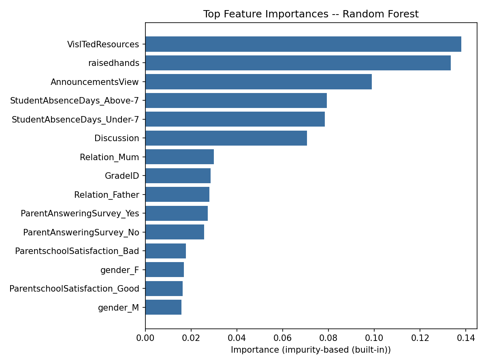
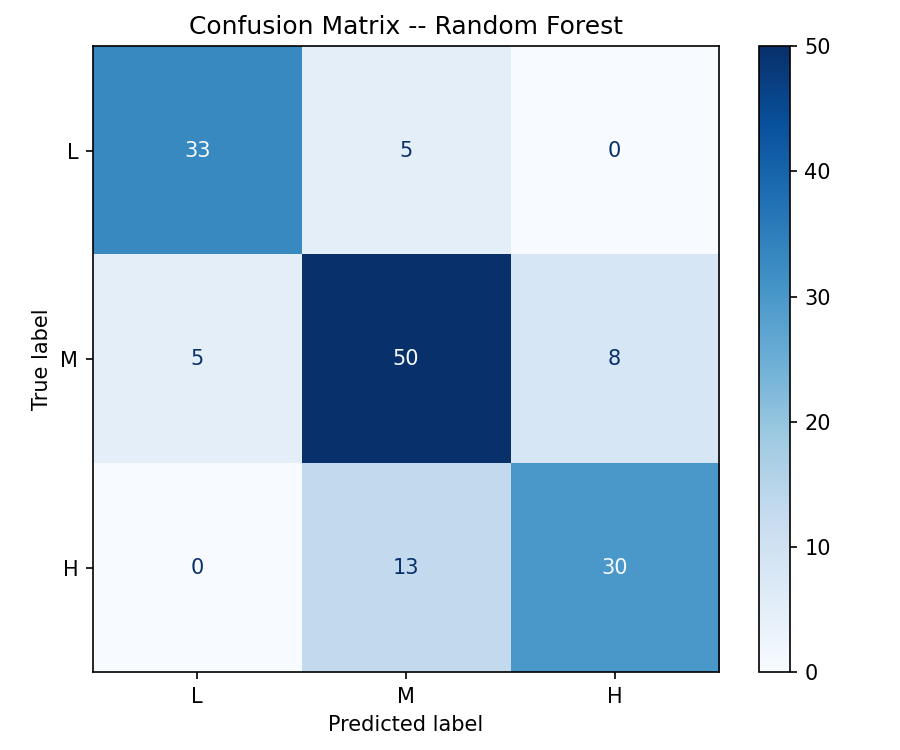

# Student Performance Prediction

Predicts a student's academic performance level (**Low / Medium / High**)
from behavioral engagement data -- participation, resource usage, absences
-- rather than grades themselves. Five classifiers are trained, tuned, and
compared on the same data: Decision Tree, Random Forest, Perceptron,
Logistic Regression, and a Multi-Layer Perceptron.

**Live demo:** deployed  -- the app is built and tested
(`src/student_performance/app.py`), deploying it just needs a couple of
clicks on your own GitHub + Streamlit account (see
[Deploying the demo](#deploying-the-demo)). Run it locally in the
meantime with the commands below.

## Problem statement

Schools generally know a student is struggling only after grades come in,
which is often too late to intervene. This project asks: *can a student's
performance tier be predicted from behavioral signals alone* -- how often
they raise their hand, how many course resources they visit, how many
classes they miss -- so at-risk students could plausibly be flagged
earlier? It's framed as a 3-class classification problem (`L`/`M`/`H`)
rather than regression, matching how the source dataset labels students.

## Dataset

[Students' Academic Performance Dataset](https://www.kaggle.com/datasets/aljarah/xAPI-Edu-Data)
(also known as xAPI-Edu-Data), 480 records from a Kuwait-based learning
management system, 16 features plus the target class:

| | |
|---|---|
| Rows | 480 |
| Features | 16 (demographic, academic, and behavioral) |
| Target | `Class`: L (Low), M (Medium), H (High) |
| Class balance | M 44.0% &nbsp;·&nbsp; H 29.6% &nbsp;·&nbsp; L 26.5% |
| Missing values | none |

Behavioral features (raised hands, resources visited, announcements
viewed, discussion participation, absences) turn out to matter far more
than demographics -- see [Feature importance](#why-random-forest-won)
below.

## Methodology

1. **Cleaning** -- `GradeID` ("G-07") is converted to an integer since
   it's genuinely ordinal; `PlaceofBirth` is dropped because it duplicates
   `NationalITy` for ~88% of rows.
2. **Preprocessing** -- numeric features are standardized, categoricals
   are one-hot encoded, all inside an `sklearn.Pipeline` fit only on the
   training fold (no leakage from the encoder seeing test data).
3. **Split** -- stratified 70/30 train/test split, fixed `random_state`
   for reproducibility.
4. **Tuning** -- each model is tuned with `GridSearchCV` (5-fold
   stratified CV, scored on macro-F1, since the classes aren't perfectly
   balanced).
5. **Evaluation** -- accuracy, macro-F1, macro-precision/recall on the
   held-out test set; confusion matrix and feature importance for the
   winning model.

Macro-F1 (rather than accuracy) is the primary metric because it weighs
all three classes equally -- accuracy alone would let a model coast by
mostly predicting the majority class `M`.

## Results

| Model | Test Accuracy | Test Macro-F1 | CV Macro-F1 |
|---|---|---|---|
| **Random Forest** | **0.785** | **0.791** | 0.809 |
| MLP Classifier | 0.764 | 0.769 | 0.732 |
| Logistic Regression | 0.722 | 0.729 | 0.774 |
| Decision Tree | 0.667 | 0.673 | 0.734 |
| Perceptron | 0.667 | 0.670 | 0.637 |
| *Majority-class baseline* | *0.438* | *0.203* | -- |

All five models comfortably beat the majority-class baseline
(predicting "M" every time), and Random Forest wins outright on both
metrics. Full numbers: [`outputs/leaderboard.csv`](outputs/leaderboard.csv)
after running training.

### Why Random Forest won



- **The signal is mostly nonlinear interactions, not linear trends.**
  Logistic Regression (linear decision boundaries) and Perceptron (no
  probabilistic margin, no tuning benefit here) both landed well behind
  the tree-based models. A tree naturally captures something like "low
  resource visits *and* high absences" without needing that interaction
  engineered by hand.
- **Bagging beats a single tree.** The plain Decision Tree overfit
  visibly -- its CV score (0.734) already trailed Random Forest's, and
  its test score dropped further (0.673). Averaging over many
  bootstrapped trees is exactly the variance reduction a dataset this
  small (480 rows) benefits from.
- **It generalized, not just memorized.** Random Forest's test macro-F1
  (0.791) is close to its CV macro-F1 (0.809) -- a small, healthy gap,
  not the sign of an overfit model that will disappoint on new data.
- **The MLP came closest**, which makes sense (neural nets can also learn
  interactions), but with only 336 training rows it doesn't have enough
  data to reliably beat a well-tuned ensemble, and its CV score (0.732)
  was noticeably less stable across folds than Random Forest's.

Feature importance (right) confirms the framing: the top 6 features are
all behavioral (`VisitedResources`, `raisedhands`, `AnnouncementsView`,
absence days, `Discussion`) and *dwarf* every demographic feature
(gender, parent relation, grade). This matches the intuition the project
set out to test -- engagement predicts performance better than who the
student is.

<br clear="right">



Errors cluster where you'd expect: `M` is the class most often confused
with its neighbors (`L` or `H`), and there is **zero** confusion between
`L` and `H` directly -- the model isn't making wild mistakes, just
missing the middle tier sometimes, which is the hardest one to call by
nature (it's bordered on both sides).

## How to increase accuracy further

Roughly in order of expected effort-to-payoff, for anyone extending this:

1. **Try gradient boosting.** `HistGradientBoostingClassifier` (built
   into sklearn, no extra dependency) or XGBoost/LightGBM typically beat
   Random Forest on tabular data like this and are worth a direct
   comparison.
2. **Widen the hyperparameter search.** The current `GridSearchCV` grids
   are intentionally small for fast iteration; a `RandomizedSearchCV` or
   `Optuna` run over a wider space (tree depth, min-samples-split,
   learning rate for boosting) would likely add a few points.
3. **Engineer interaction/aggregate features** -- e.g. a single
   "engagement score" combining raised hands + resources + discussion,
   or ratios like `raisedhands / (raisedhands + AnnouncementsView)` --
   since tree models benefit from these even though they can approximate
   them internally.
4. **Address the class imbalance directly** rather than only weighting
   the metric: `class_weight="balanced"` on the linear/tree models, or
   oversampling the minority classes (SMOTE) before training.
5. **Get more data.** 480 rows is small for a 3-class problem with 16
   raw features; the CV/test score gap for every model would likely
   shrink with a larger sample, and rarer feature combinations (e.g.
   unusual nationality + high absences) would stop being noise.
6. **Nested cross-validation** for a less optimistic accuracy estimate --
   the current single train/test split plus CV-for-tuning can still be
   mildly optimistic since the same test set is reused for final
   comparison across all 5 models.
7. **Stack the top 2-3 models** (Random Forest + MLP + Logistic
   Regression) with `StackingClassifier` -- their errors aren't
   perfectly correlated, so a meta-learner over their predictions can
   sometimes beat the single best model.

## How to run

```bash
python3 -m venv .venv && source .venv/bin/activate
pip install -e ".[dev]"

# Train + compare all 5 models, save the best one, leaderboard, and plots
python -m student_performance.train

# Regenerate EDA plots into outputs/
python -m student_performance.visualize

# Predict on a single student (flags, --interactive, or --json-file)
python -m student_performance.predict --interactive

# Launch the interactive web demo
pip install -e ".[app]"
streamlit run src/student_performance/app.py

# Run tests (includes headless tests of the Streamlit app)
pytest
```

Trained model, leaderboard CSV, and plots are written to `models/` and
`outputs/` (gitignored -- regenerate by running `train.py` /
`visualize.py`; the images embedded above are committed separately under
`docs/images/` so the README renders without a training run).

## Deploying the demo

The app itself is ready (`src/student_performance/app.py`), tested headlessly
via `tests/test_app.py` using Streamlit's `AppTest` framework. It just needs
to be pushed to a place that can serve it. Free option, ~2 minutes:

1. Push this repo to your own GitHub account.
2. Go to [share.streamlit.io](https://share.streamlit.io), sign in with
   GitHub, click **New app**.
3. Pick the repo, set the main file path to
   `src/student_performance/app.py`, deploy.
4. Streamlit Cloud installs from the root `requirements.txt` automatically
   (already includes `streamlit`) -- no extra config needed.
5. Copy the resulting `*.streamlit.app` URL into this README's
   [Live demo](#student-performance-prediction) line and your resume.


## Project layout

```
data/                       # raw dataset
src/student_performance/    # config, data, pipeline, train, predict, visualize
tests/                      # pytest 
docs/images/                # committed result plots, referenced above

```

